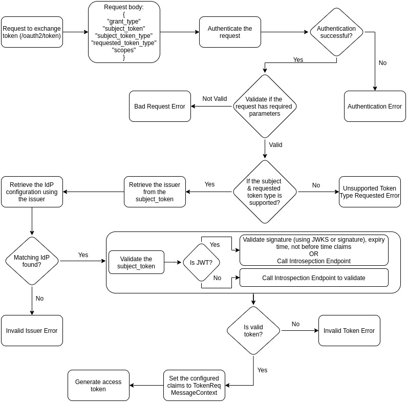

# External Identity Provider (IdP) Support for Choreo API Management

Choreo provides admin permissions to privileged users to configure different authorization servers as Identity Providers (IdPs) from the Choreo Console. This brings the capability of supporting multiple IdPs for a given API. Hence, users in these external userbases can get authenticated with Choreo by exchanging the external IdP token .

## Token exchange

Token Exchange Grant Type is a protocol for an HTTP and JSON-based Security Token Service by defining how to request and obtain security tokens from OAuth 2.0 authorization servers. With this capability, you can exchange a JSON Web Token (JWT) issued by an external IdP for a Choreo token. (For more information, see [Generate Access Tokens using an External Identity Provider]())

{.cInlineImage-full}

When you provide a JWT access token (referred to as the `subject_token` in the above diagram), a request will be sent to the Choreo token endpoint to exchange the provided JWT to a Choreo JWT. After validating the request sent, the matching IdP configuration based on the issuer (`iss` inside the JWT) will be retrieved.

Then the `subject_token` will be validated (signature and expiry time validation). After the successful validation of the token, a token request will be sent to generate a Choreo access token. Then it will be displayed to you.
