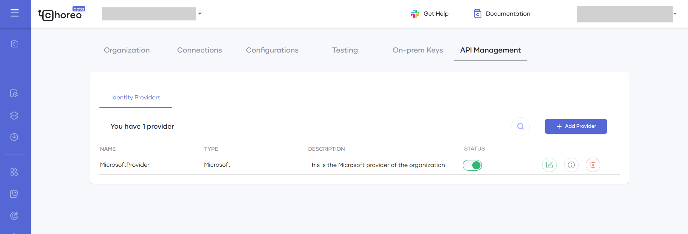
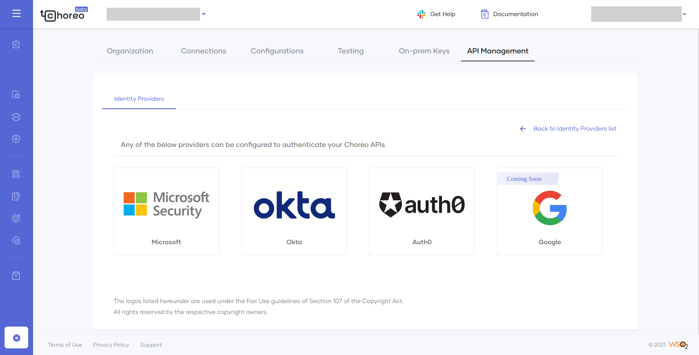
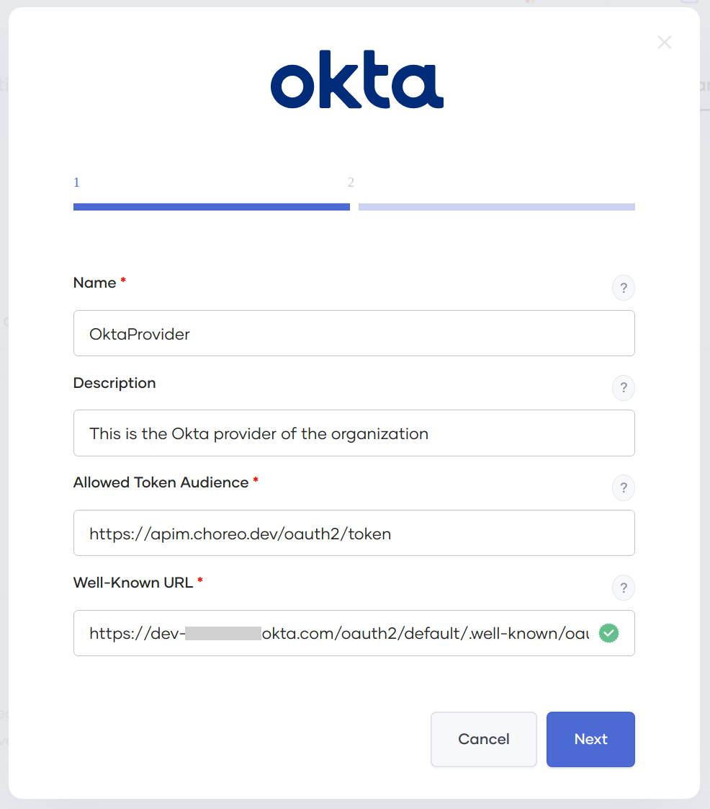
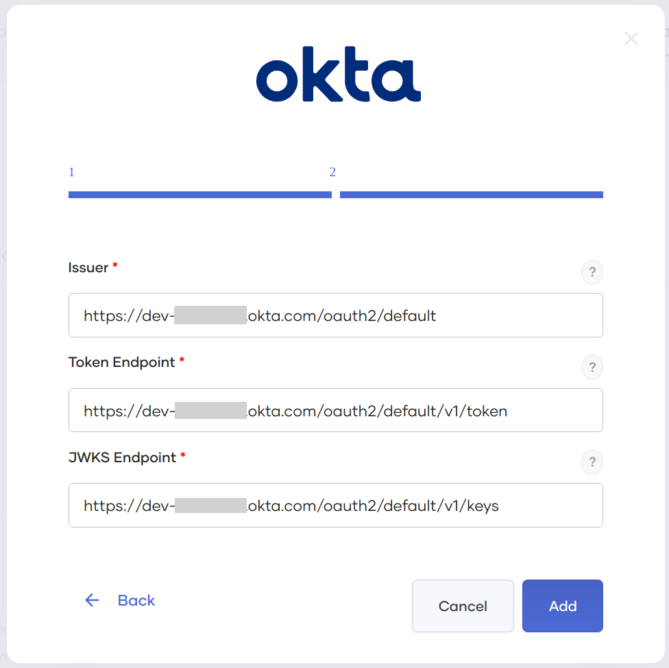

# Registering an External Identity Provider (IdP) for Choreo API Management

Choreo uses an in-built Identity Provider (IdP) to manage the OAuth clients and generate tokens that are required to authenticate Choreo APIs by default. However, it is possible to add one or more external IdP(s) for your Choreo organization, so that you can obtain access tokens from that IdP and exchange those to Choreo access tokens that can be used to invoke APIs (See [Exchange an Access Token from an External Identity Provider]({{base_path}}/identity-providers/exchange-an-access-token-from-an-external-identity-provider) for more information). This will give you the ability to expose your APIs to the users who are external to Choreo.

Follow this procedure to add/register an external IdP to your Choreo organization.

!!! note
    You need to be an `Organization Admin` to add an external IdP.

1. Sign in to the Choreo Console at [https://console.choreo.dev/](https://console.choreo.dev/).

2. Go to the left menu bar and click on the **Settings** at the bottom.    

3. Navigate to the **API Management** section and go to the **Identity Providers** section. The existing IdPs in your organization will be listed as shown below.

    {.cInlineImage-full}

4. Click on the **+ Add Provider** button and the supported IdP types by Choreo will be displayed.

    {.cInlineImage-full}

5. Click on the type of the IdP that you need to add and a form will be displayed. (Note that this example will show you how to add an **Okta** IdP. But the steps and the fields are similar for other IdP types as well)

6. Fill the **Name**, **Description**, **Allowed Token Audience** and the **Well-Known URL** and click **Next**. (Refer to the below table to learn more about these fields) 

    <table>
    <tr class="header">
    <th><b>Field</b></th>
    <th><b>Description</b></th>
    <th> </th>
    </tr>
    <tr class="odd">
    <td>Name</td>
    <td>The name of the IdP. This value cannot be modified once created.</td>
    <td>Mandatory</td>
    </tr>
    <tr class="even">
    <td>Description</td>
    <td>A brief description of the IdP.</td>
    <td>Optional</td>
    </tr>
    <tr class="odd">
    <td>Allowed Token Audience</td>
    <td><b>Okta:</b> The audience of the Authorization Server for which the access token is intended for. 
        There will be a default value on the placeholder of this field.  
        You can update this value in the Okta Authorization server in the following path. 
        Security → API → Authorization Server → Your Authorization Server → Settings → Audience  
        <b>Microsoft:</b> The identifier that indicates the intended recipient of the token. 
        This value should be the application ID URI of the application in Azure Active Directory (Azure AD) for which the token is requested.
          
        <b>Auth0:</b> A unique identifier of the API that will be used as the audience parameter in the authorization call. 
         You can update this value in the Auth0 server in the following path. 
         Applications → APIs → Your API → General Settings → Identifier 
    </td>
    <td>Mandatory</td>
    </tr>
    <tr class="even">
    <td>Well-Known URL</td>
    <td>
The OpenID Connect Discovery endpoint URL that returns the metadata related to the OpenID Provider's configuration. 
    When the Well-known URL is provided, other endpoints such as as the Issuer, Token Endpoint and the JSON Web Key Set (JWKS) endpoint will be automatically filled in the next step.

    </td>
    <td>Mandatory</td>
    </tr>
    </table>

     {.cInlineImage-full}

7. The **Issuer**, **Token Endpoint** and the **JWKS Endpoint** fields will be automatically filled based on the **Well-Known URL** you provided earlier. You can manually change these values if you want or keep them as it is. (Refer to the below table to learn more about these fields) 

    <table>
    <tr class="header">
    <th><b>Field</b></th>
    <th><b>Description</b></th>
    <th> </th>
    </tr>
    <tr class="odd">
    <td>Issuer</td>
    <td>The issuer identifier of the IdP. This can be found in the `iss` claim of the JWT issued.</td>
    <td>Mandatory</td>
    </tr>
    <tr class="even">
    <td>Token Endpoint</td>
    <td>The token endpoint URL of the IdP from where the OAuth client can get an access token.</td>
    <td>Mandatory</td>
    </tr>
    <tr class="odd">
    <td>JWKS Endpoint</td>
    <td>The URL that returns the JSON Web Key (JWK) set of the IdP. This returns a collection of JSON Web Keys, which are used to verify the signature of the JWT tokens.
    </td>
    <td>Mandatory</td>
    </tr>
    </table>

     {.cInlineImage-full}

8.  Click on the **Add** button.
